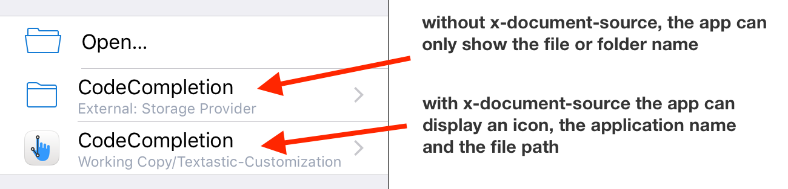

# x-document-source

## Motivation

iOS apps usually only have access to files in their own sandbox container. The [document picker](https://developer.apple.com/library/ios/documentation/FileManagement/Conceptual/DocumentPickerProgrammingGuide/Introduction/Introduction.html) which was introduced in iOS 8 lets users import or open files from iCloud Drive and third-party apps. Apps can add  [document provider extensions](https://developer.apple.com/library/prerelease/content/documentation/General/Conceptual/ExtensibilityPG/FileProvider.html) to make them appear in the list of locations of the document picker.

When the user picks a file or folder, the app that invoked the document picker only [gets a security-scoped url](https://developer.apple.com/library/ios/documentation/UIKit/Reference/UIDocumentPickerDelegate/index.html#//apple_ref/occ/intfm/UIDocumentPickerDelegate/documentPicker:didPickDocumentAtURL:), but no additional information about the app that provided it.

For iCloud Drive documents, apps can use the [NSURLUbiquitousItemContainerDisplayNameKey](https://developer.apple.com/reference/foundation/nsurlubiquitousitemcontainerdisplaynamekey?language=objc) to get the name of the item's iCloud Drive container.

Unfortunately, no such information is available for third-party document providers. The app accessing external files has no immediate way to know which app provides these files.

We describe a way to share such information using an [extended file attribute](https://en.m.wikipedia.org/wiki/Extended_file_attributes) in a way that has minimal consequences for apps unaware of this mechanism. 



## Writing the Extended File Attribute

When files or directories are picked, the app extension should use the [setxattr](https://developer.apple.com/legacy/library/documentation/Darwin/Reference/ManPages/man2/setxattr.2.html) function to write an extended file attribute named `x-document-source` containing a **property list in binary format**. As an example, here is how such a property list might look:

```objc
NSDictionary *plist = @{
    @"identifier": @"com.appliedphasor.working-copy",
    @"name": @"Working Copy",
    @"path": @"directory/filename.ext",
    @"appInfoURL": @"https://raw.githubusercontent.com/palmin/x-document-source/master/appInfo.json"
};
```


## App Icons

Icon files are not included in the extended file attribute to keep it small.

Instead, app icons can be retrieved by accessing the JSON file pointed to by `appInfoURL`. This file will itself reference icons at different resolutions and the `src` value can be either a fully qualified URL or relative to the JSON file itself.

You should serve the files from **a secure website** (https) to comply with App Transport Security.

```json
{"icons":
[{"width": 29, "height": 29, "src": "/img/icon.png"},
 {"width": 58, "height": 58, "src": "/img/icon@2x.png"},
 {"width": 87, "height": 87, "src": "/img/icon@3x.png"},
 {"width": 1024, "height": 1024, "src": "/img/icon-1024.png"}
]}
```

It is the responsibility of the app reading these images to mask the image to the superellipse shape expected for app icons. This repository contains code for this. 

## Adoption

So far, x-document-source has been implemented by [Working Copy](https://workingcopyapp.com) and [Textastic](https://www.textasticapp.com) v6.2 (currently in beta). 

If you have an app that is either a document provider or uses the iOS document picker: please have a look at the `XDSDocumentSourceAttribute` class in this repository and add it to your app!

A document provider might write this extended attribute as part of `dismissGrantingAccessToURL` in `UIDocumentPickerExtensionViewController`:
```objc
- (void)dismissGrantingAccessToURL:(NSURL *)url {
    // determine documentPath relative to rootStorageURL
    NSString* rootPath = self.documentStorageURL.path;
    NSRange range = [url.path rangeOfString: rootPath.lastPathComponent];
    NSString* documentPath = [url.path substringFromIndex:range.location + range.length];

    NSURL* appInfoURL = [NSURL URLWithString:@"https://workingcopyapp.com/appInfo.json"];
    XDSDocumentSourceAttribute* attribute = [XDSDocumentSourceAttribute documentSourceAttributeWithBundleIdentifier:@"com.appliedphasor.working-copy"
                                                                                                    applicationName:@"Working Copy"
                                                                                                       documentPath:documentPath
                                                                                                         appInfoURL:appInfoURL];
    [attribute writeToURL:url];

    [super dismissGrantingAccessToURL:url];
}
```